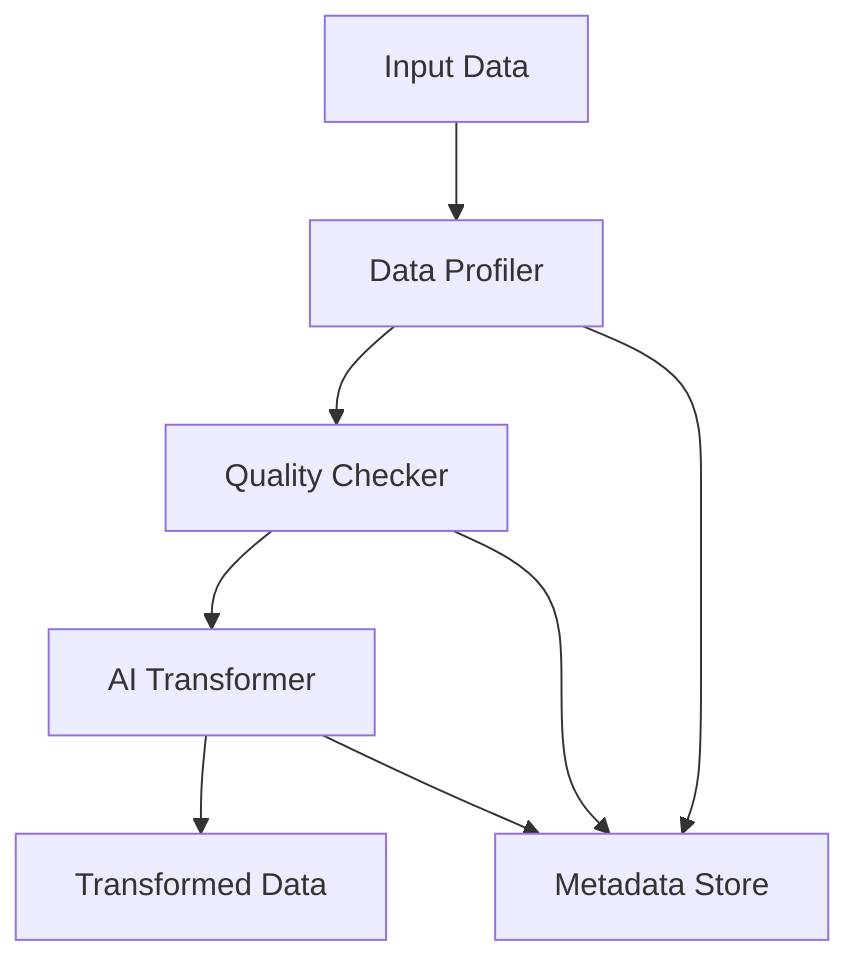

# Enterprise Data Transformation Pipeline Documentation

## Overview

This documentation provides a detailed explanation of the Enterprise Data Transformation Pipeline, a sophisticated system designed to process, validate, and transform data using Generative AI.

## System Architecture

### Core Components

1. **Data Pipeline (`src/pipeline/index.js`)**
   - Central orchestrator managing the entire transformation process
   - Coordinates between profiling, quality checks, and transformation stages
   - Handles metadata storage and error management

2. **Data Profiler (`src/pipeline/profiler.js`)**
   - Analyzes input data structure and content
   - Features:
     - Automatic type inference
     - Statistical analysis (null counts, unique values)
     - Pattern detection
     - Column-level metadata generation

3. **Quality Checker (`src/pipeline/quality.js`)**
   - Validates data against predefined rules
   - Key validations:
     - Null threshold checks (max 20% nulls per column)
     - Unique constraint validation
     - Data type consistency
     - Custom rule support

4. **AI Transformer (`src/pipeline/transformer.js`)**
   - Leverages GPT-4 for intelligent data transformations
   - Capabilities:
     - Data standardization
     - Format conversion
     - Value enrichment
     - Pattern-based transformations

5. **Metadata Store (`src/storage/metadata.js`)**
   - SQLite-based metadata management
   - Tracks:
     - Data profiles
     - Transformation history
     - Quality reports
     - Processing lineage

## Data Flow



## Process Details

### 1. Data Profiling Phase

```javascript
// Example profile output
{
  "rowCount": 1000,
  "columns": {
    "id": {
      "type": "number",
      "nullCount": 0,
      "uniqueCount": 1000,
      "nullPercentage": 0
    },
    "email": {
      "type": "string",
      "nullCount": 5,
      "uniqueCount": 995,
      "nullPercentage": 0.5
    }
  }
}
```

### 2. Quality Validation Phase

Rules checked:
- Null thresholds (< 20% nulls)
- Unique constraints for specific columns
- Data type consistency
- Custom business rules

### 3. AI Transformation Phase

The transformer uses GPT-4 to:
1. Analyze data patterns
2. Generate transformation rules
3. Apply standardization
4. Enrich data where possible

### 4. Metadata Management

Tables structure:
```sql
-- Data Profiles
CREATE TABLE data_profiles (
  id INTEGER PRIMARY KEY,
  timestamp DATETIME,
  profile_data JSON
);

-- Transformations
CREATE TABLE transformations (
  id INTEGER PRIMARY KEY,
  timestamp DATETIME,
  profile_id INTEGER,
  quality_report JSON,
  output_path TEXT
);
```

## Configuration

### Environment Variables

```env
OPENAI_API_KEY=your_api_key
```

### Pipeline Configuration

```javascript
{
  inputPath: './data/input',
  outputPath: './data/output',
  metadataDb: './data/metadata.db'
}
```

## Usage Examples

### Basic Usage

```javascript
import { pipeline } from './pipeline/index.js';

// Initialize pipeline
await pipeline.initialize({
  inputPath: './data/input.csv',
  outputPath: './data/output',
  metadataDb: './data/metadata.db'
});

// Run pipeline
await pipeline.run();
```

### Custom Quality Rules

```javascript
class CustomQualityChecker extends QualityChecker {
  constructor() {
    super();
    this.rules.push(this._customBusinessRule);
  }

  async _customBusinessRule(profile) {
    // Implement custom validation logic
  }
}
```

## Error Handling

The pipeline implements comprehensive error handling:

1. **Validation Errors**
   - Data quality failures
   - Schema violations
   - Business rule violations

2. **Processing Errors**
   - Transformation failures
   - AI model errors
   - I/O errors

3. **System Errors**
   - Database connection issues
   - Resource constraints
   - Configuration problems

## Monitoring and Logging

The system uses a structured logging approach:

```javascript
logger.info('Starting data profiling');
logger.error('Transformation failed:', error);
logger.warn('High null percentage in column:', column);
```

## Performance Considerations

1. **Memory Management**
   - Streaming data processing
   - Batch processing for large datasets
   - Efficient memory allocation

2. **Scalability**
   - Modular component design
   - Parallel processing support
   - Resource optimization

3. **Optimization Tips**
   - Use appropriate batch sizes
   - Implement caching where beneficial
   - Monitor memory usage

## Testing

### Unit Tests

```bash
npm test
```

Test coverage includes:
- Data profiling accuracy
- Quality validation rules
- Transformation logic
- Metadata storage

### Integration Tests

Tests verify:
- End-to-end pipeline flow
- Component interaction
- Error handling
- Data consistency

## Deployment

### Prerequisites
- Node.js 18+
- SQLite3
- OpenAI API access

### Installation Steps
1. Clone repository
2. Install dependencies
3. Configure environment
4. Initialize database
5. Run tests
6. Start pipeline

## Security

Security measures implemented:
1. Input validation
2. Data sanitization
3. Access control
4. Secure API handling
5. Error message sanitization

## Best Practices

1. **Data Handling**
   - Validate input data
   - Handle sensitive information
   - Implement error recovery
   - Maintain data integrity

2. **Code Organization**
   - Follow modular design
   - Implement clean architecture
   - Use consistent naming
   - Document complex logic

3. **Performance**
   - Optimize resource usage
   - Implement caching
   - Use efficient algorithms
   - Monitor system health